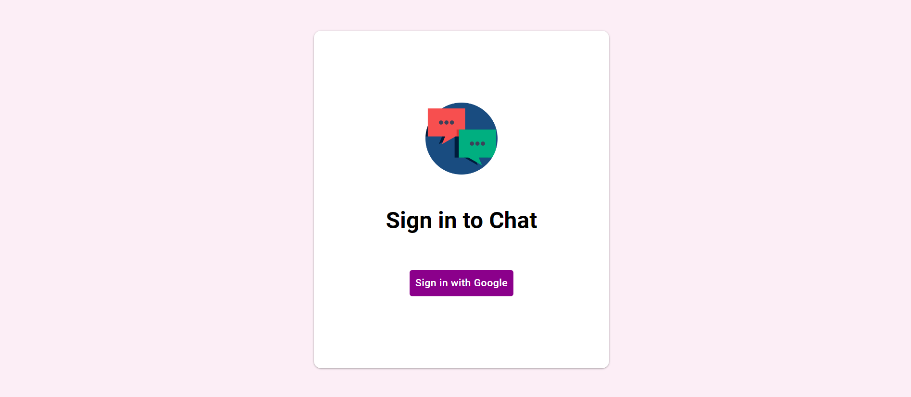

## Chat-Application

A Chat-Application built with [technology stack used] for learning and demonstration purposes.

### Table of Contents
- [Features](#features)
- [Technologies Used](#technologies-used)
- [Getting Started](#getting-started)
- [Prerequisites](#prerequisites)

### Features

- **Real-time messaging**: Instant messaging with real-time updates.
- **Group Chats**: Create and join group conversations.
- **Image and file sharing**: Share images and files within Chats.
- **User authentication**: Secure user registration and login.
- **Push notifications (optional)**: Receive notifications for new messages.

### Technologies Used

#### Frontend:

- **React**: A JavaScript library for building user interfaces.
- **JavaScript**: The programming language used for frontend development.

#### Backend:

- **Node.js**: A JavaScript runtime for building scalable server-side applications.
- **Firebase**: A platform for building web and mobile applications without server-side programming or managing infrastructure.

## Getting Started

#### Prerequisites

- Node.js
- npm (Node package manager)
- Firebase account (for backend services)
- React and JavaScript knowledge

